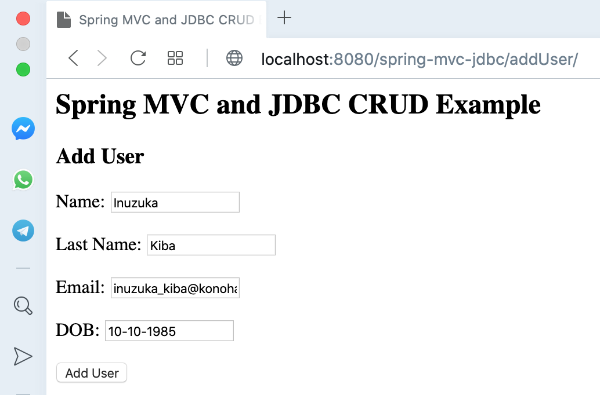
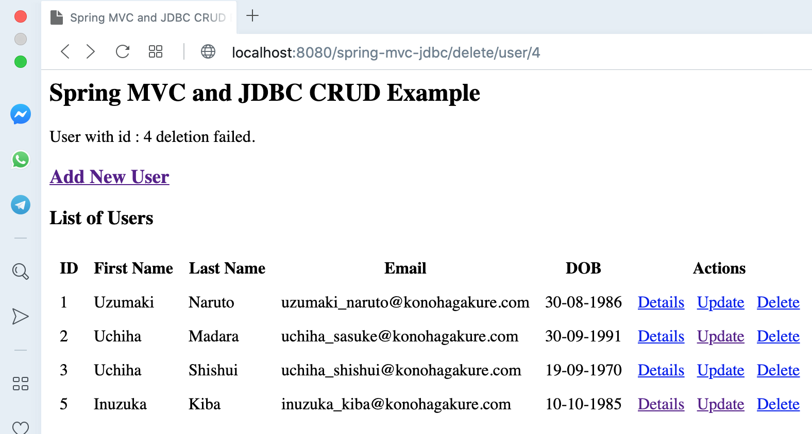
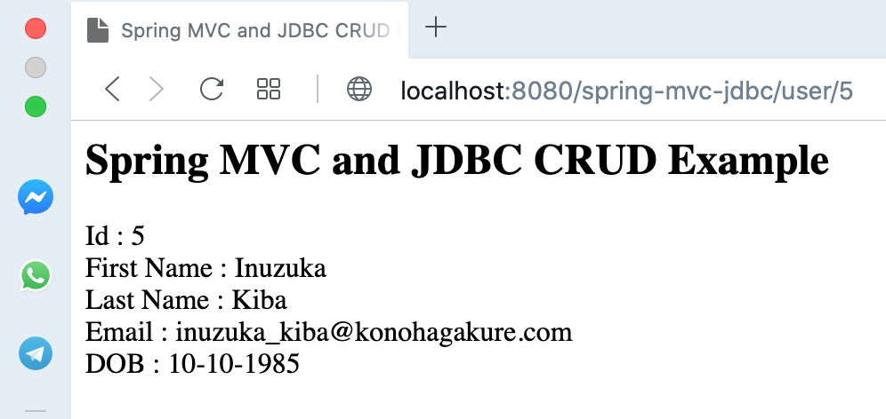
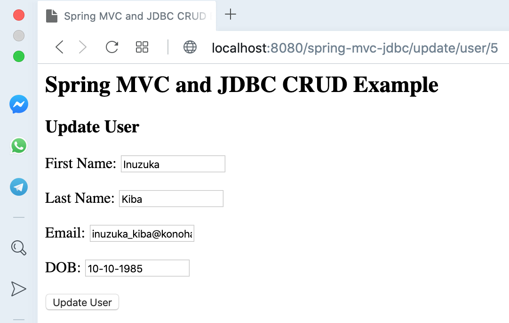
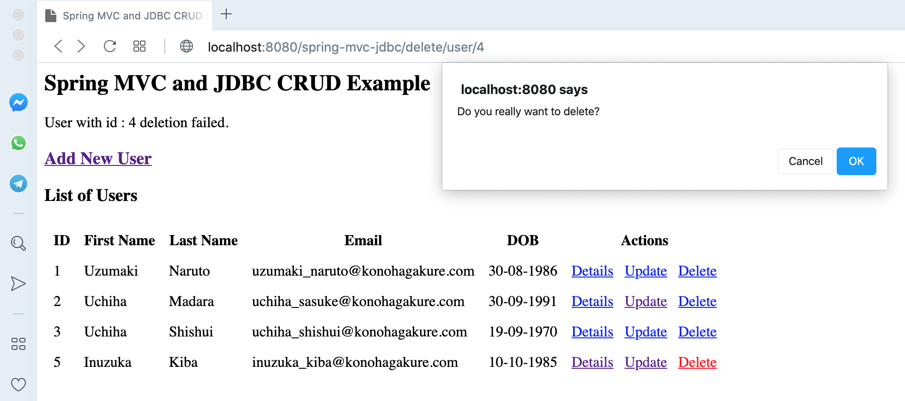

# spring-mvc-jdbc

## Things To Do List:
1. Clone repository: `git clone https://github.com/hendisantika/spring-mvc-jdbc.git`
2. Go to the folder: `cd spring-mvc-jdbc`
3. Run application: `mvn clean package tomcat7:run`
4. Open your favorite browser: http://localhost:8080/spring-mvc-jdbc/users

## Screen shot

## Add New User

## List All Users

## User Details

## Update User

## Delete User

